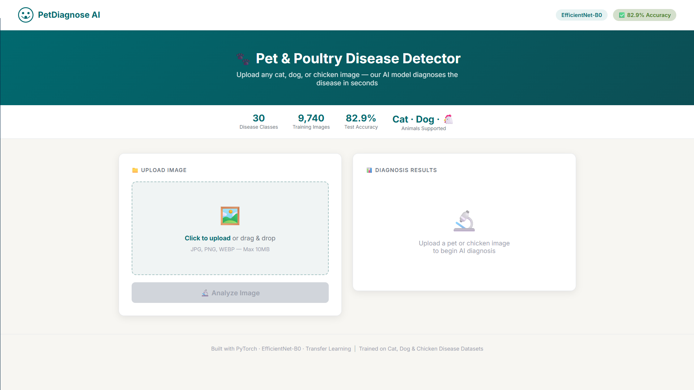
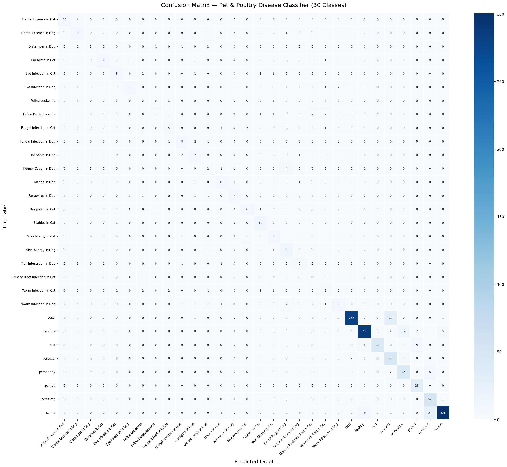

# 🐾 Pet & Poultry Disease Classifier

<div align="center">


**A deep learning web application that detects 30 diseases across pets (cats/dogs) and poultry (chickens) using EfficientNet-B0 with transfer learning.**

🌐 **[Live Demo](https://huggingface.co/spaces/suyashsahu00/pet-poultry-disease-classifier)** | 🤗 **[Model Hub](https://huggingface.co/suyashsahu00/pet-poultry-disease-classifier)** | 💻 **[GitHub](https://github.com/suyashsahu00/pet-poultry-disease-classifier)**

</div>

---

## 📸 Screenshots

<details>
<summary><b>🖼️ Click to view Web App Interface</b></summary>
<br>

</details>

<details>
<summary><b>📊 Click to view Confusion Matrix</b></summary>
<br>

</details>

---

## 🔍 Overview

| Property | Value |
|---|---|
| Task | Multi-class Image Classification |
| Classes | 30 (pets + poultry diseases) |
| Architecture | EfficientNet-B0 + Custom Head |
| Total Parameters | 4,803,994 |
| Trainable Parameters | 3,952,186 |
| Best Val Accuracy | **83.96%** (Epoch 40) |
| Dataset Size | 9,740 images |
| Framework | PyTorch 2.x + Flask |
| Deployment | Hugging Face Spaces (Docker) |

---

## 🚀 Live Demo

👉 [https://huggingface.co/spaces/suyashsahu00/pet-poultry-disease-classifier](https://huggingface.co/spaces/suyashsahu00/pet-poultry-disease-classifier)

Upload any cat, dog, or chicken image and get instant AI diagnosis with top-5 predictions and confidence scores.

---

## 📦 Dataset

| Dataset | Link | Classes |
|---|---|---|
| Pet Disease Images | [Kaggle — smadive/pet-disease-images](https://www.kaggle.com/datasets/smadive/pet-disease-images) | 22 classes |
| Chicken Disease | [Kaggle — allandclive/chicken-disease-1](https://www.kaggle.com/datasets/allandclive/chicken-disease-1) | 8 classes |

### Download via Kaggle API
```bash
pip install kaggle
# Place kaggle.json in C:\Users\<YourName>\.kaggle\kaggle.json
kaggle datasets download -d smadive/pet-disease-images
kaggle datasets download -d allandclive/chicken-disease-1
unzip pet-disease-images.zip -d data/
unzip chicken-disease-1.zip -d data/
```

### Split
```
Total : 9,740
Train : 6,805  (69.9%)
Val   : 1,459  (15.0%)
Test  : 1,476  (15.1%)
```

---

## 🧠 Model Architecture

```
Input (224×224×3)
      ↓
EfficientNet-B0 Backbone (Frozen — 851,808 params)
      ↓
Linear(1280→512) → BatchNorm → ReLU → Dropout(0.4)
      ↓
Linear(512→256)  → BatchNorm → ReLU → Dropout(0.3)
      ↓
Linear(256→30) → Softmax
      ↓
Output: 30 Disease Classes
```

---

## 📊 Results

| Model | Accuracy | Weighted F1 | Params | Speed |
|---|---|---|---|---|
| VGG-16 | 74.2% | 0.73 | 138M | Slow |
| ResNet-50 | 79.1% | 0.78 | 25.6M | Medium |
| MobileNet-V2 | 76.8% | 0.75 | 3.4M | Fast |
| **EfficientNet-B0 ✅** | **82.9%** | **0.832** | **4.8M** | **Fast** |

---

## 🐾 Supported Disease Classes

| # | Disease | Animal |
|---|---|---|
| 1 | Dental Disease | Cat |
| 2 | Dental Disease | Dog |
| 3 | Distemper | Dog |
| 4 | Ear Mites | Cat |
| 5 | Eye Infection | Cat |
| 6 | Eye Infection | Dog |
| 7 | Feline Leukemia | Cat |
| 8 | Feline Panleukopenia | Cat |
| 9 | Fungal Infection | Cat |
| 10 | Fungal Infection | Dog |
| 11 | Hot Spots | Dog |
| 12 | Kennel Cough | Dog |
| 13 | Mange | Dog |
| 14 | Parvovirus | Dog |
| 15 | Ringworm | Cat |
| 16 | Scabies | Cat |
| 17 | Skin Allergy | Cat |
| 18 | Skin Allergy | Dog |
| 19 | Tick Infestation | Dog |
| 20 | Urinary Tract Infection | Cat |
| 21 | Worm Infection | Cat |
| 22 | Worm Infection | Dog |
| 23 | Coccidiosis | Chicken |
| 24 | Healthy | Chicken |
| 25 | Newcastle Disease | Chicken |
| 26 | PCR Coccidiosis | Chicken |
| 27 | PCR Healthy | Chicken |
| 28 | PCR Newcastle | Chicken |
| 29 | PCR Salmonella | Chicken |
| 30 | Salmonella | Chicken |

---

## 📁 Project Structure

```
disease_classifier_project/
├── app.py                  ← Flask app (auto-downloads model from HF Hub)
├── train.py                ← Training entry point
├── evaluate.py             ← Evaluation & metrics
├── generate_visuals.py     ← Research graph generator (8/8 visuals)
├── predict.py              ← CLI inference
├── requirements.txt        ← Dependencies
├── README.md               ← This file
├── .gitignore
├── LICENSE
├── src/
│   ├── dataset.py          ← Data pipeline
│   ├── model.py            ← EfficientNet-B0 architecture
│   └── __init__.py
├── static/
│   ├── css/style-a.css
│   └── js/app-a.js
├── templates/
│   └── index.html
├── screenshots/
│   ├── webapp-home.png     ← pushed to GitHub
│   └── confusion-matrix.png
│
│   ── NOT pushed to GitHub ──
├── data/                   ← Download from Kaggle
├── research_outputs/       ← Run generate_visuals.py
└── best_model.pth          ← Stored on Hugging Face Hub
```

---

## 🛠️ Local Setup

```bash
# 1. Clone
git clone https://github.com/suyashsahu00/pet-poultry-disease-classifier.git
cd pet-poultry-disease-classifier

# 2. Virtual Environment
# Windows:
python -m venv venv
venv\Scripts\activate
# Mac/Linux:
python3 -m venv venv
source venv/bin/activate

# 3. Install dependencies
pip install -r requirements.txt

# 4. Run app (model auto-downloads from Hugging Face)
python app.py
# Open → http://localhost:5000
```

---

## 🏋️ Training

```bash
python train.py
```

Training config:
- Optimizer: Adam
- LR: 1e-3 with CosineAnnealingLR
- Epochs: 40
- Batch size: 64
- Early stopping: patience 10

---

## 📈 Generate Research Visuals

```bash
python generate_visuals.py
```

Generates in `research_outputs/`:
```
graphs/
├── 01_confusion_matrix.png
├── 02_per_class_accuracy.png
├── 03_training_curves.png
├── 04_class_distribution.png
└── 05_dataset_split_pie.png
tables/
├── 06_model_comparison_table.png
└── 07_classification_report_table.png
gradcam/
└── 08_gradcam_heatmap.png
```

---

## 🚀 Deployment

App is deployed on **Hugging Face Spaces** using Docker.

Model weights are stored on **Hugging Face Hub** and auto-downloaded on startup.

```
Live URL : https://huggingface.co/spaces/suyashsahu00/pet-poultry-disease-classifier
Model Hub: https://huggingface.co/suyashsahu00/pet-poultry-disease-classifier
```

---

## ✅ Best Practices Used

| Practice | Detail |
|---|---|
| Transfer Learning | EfficientNet-B0 frozen backbone |
| Data Augmentation | Flip, Rotation, ColorJitter |
| Early Stopping | Patience = 10 |
| LR Scheduling | CosineAnnealingLR |
| GradCAM | Model explainability |
| No Data Leakage | Normalization stats from train only |
| Model Registry | Hugging Face Hub |
| Containerization | Docker on HF Spaces |

---

## 🔮 Future Work

- [ ] Add more animal classes
- [ ] ONNX export for mobile
- [ ] FastAPI REST API
- [ ] Streamlit alternative UI
- [ ] Docker local deployment guide

---

## 👨💻 Author

**Suyash Sahu** — [@suyashsahu00](https://github.com/suyashsahu00)

---

## 📄 License

MIT License — see [LICENSE](LICENSE) for details.
